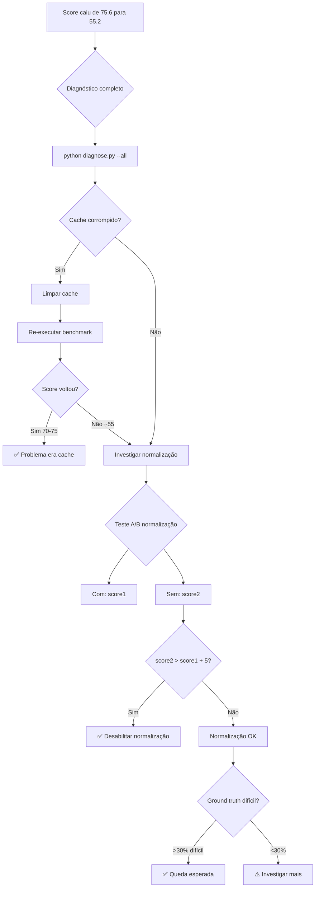

# 🔍 GUIA DE DIAGNÓSTICO - Investigação de Performance

**Versão:** 3.0
**Data:** 2025-10-31
**Para:** Investigar queda de performance de 75.6 para 55.2

---

## 📊 RESUMO DO PROBLEMA

| Métrica | Benchmark Inicial | Benchmark v2.0 | Variação |
|---------|------------------|----------------|----------|
| Score | **75.6** | **55.2** | **-20.4** (-27%) |
| Top-5 | 87.5% | 55.7% | -31.8% |
| Top-1 | 62.5% | 36.4% | -26.1% |

**Modelo testado:** `intfloat/multilingual-e5-base`

---

## 🛠️ FERRAMENTAS DE DIAGNÓSTICO

### 1. Script de Diagnóstico Completo

```bash
python diagnose.py --all
```

**O que faz:**
- ✅ Verifica integridade do cache
- ✅ Testa impacto da normalização
- ✅ Analisa dificuldade do ground truth
- ✅ Compara com resultados anteriores

**Testes individuais:**
```bash
python diagnose.py --cache              # Apenas cache
python diagnose.py --normalization      # Apenas normalização
python diagnose.py --ground-truth       # Apenas ground truth
python diagnose.py --baseline           # Apenas comparação
```

---

## 🔍 INVESTIGAÇÃO 1: PROBLEMA É DO CACHE?

### Como Saber

Execute o diagnóstico:
```bash
python diagnose.py --cache
```

**Sinais de cache corrompido:**
```
⚠️  Modelo com nome genérico: SentenceTransformer (12731 embeddings)
⚠️  Possíveis duplicados: 50 grupos
```

### Solução

Se cache estiver corrompido:
```bash
# 1. Limpar cache
python clear_cache.py

# 2. Re-executar benchmark
python run_definitive_benchmark.py --quick

# 3. Comparar resultado
# Se score voltar para ~75: cache era o problema ✅
# Se score continuar ~55: problema é outro ⚠️
```

### Teste Manual

Verificar nome do modelo no cache:
```bash
# Deve mostrar nome real do modelo, não "SentenceTransformer"
cat cache/embeddings/metadata.json | grep "model"
```

**Esperado:**
```json
"model": "intfloat/multilingual-e5-base"
```

**Corrompido:**
```json
"model": "SentenceTransformer"  ❌
```

---

## 📝 INVESTIGAÇÃO 2: PROBLEMA É DA NORMALIZAÇÃO?

### Como Saber

Execute o diagnóstico:
```bash
python diagnose.py --normalization
```

**Output mostrará:**
```
Original:    NCM 0901.11.10: Café em grão não descafeinado
Normalizado: ncm 0901 11 10 cafe grao nao descafeinado
⚠️  Palavras perdidas: em, :, .
```

Se muitas palavras forem perdidas (>50% dos casos), normalização pode estar agressiva.

### Teste A/B

**Teste 1: COM normalização (padrão)**
```bash
python run_definitive_benchmark.py --quick
# Resultado: score1
```

**Teste 2: SEM normalização**
```bash
python run_definitive_benchmark.py --quick --no-normalize
# Resultado: score2
```

**Análise:**
```python
if score2 > score1 + 5:
    print("Normalização está PREJUDICANDO!")
    # Ação: Desabilitar ou suavizar normalização
elif score2 < score1 - 5:
    print("Normalização está AJUDANDO!")
    # Ação: Manter normalização
else:
    print("Normalização tem impacto neutro")
    # Ação: Pode manter ou remover
```

### Solução

Se normalização for o problema, **desabilitar**:

```python
# Em data_loader.py (linha 292)
# Comentar normalização:
else:
    # Retorna SEM normalização
    return texto  # USAR SEMPRE ESTA LINHA
```

Ou permanentemente via ambiente:
```bash
export DISABLE_NORMALIZATION=1
python run_definitive_benchmark.py
```

---

## 🎯 INVESTIGAÇÃO 3: GROUND TRUTH MUITO DIFÍCIL?

### Como Saber

Execute o diagnóstico:
```bash
python diagnose.py --ground-truth
```

**Output:**
```
Distribuição de Dificuldade:
  Fáceis:  30/88 (34.1%)
  Médios:  40/88 (45.5%)
  Difíceis: 18/88 (20.5%)  👈 Se >30%, é esperado queda
```

### Análise

**Casos difíceis que diminuem score:**
```python
# Muito genéricos
("carro", "8703")              # Difícil - pode ser vários NCMs
("celular", "8517")            # Difícil - ambíguo

# Muito específicos
("smartphone samsung galaxy s21 128gb", "8517")  # Muito específico

# Erros ortográficos
("telefon celular", "8517")     # Erro de digitação

# Outras línguas
("mobile phone", "8517")        # Inglês
```

### Solução

**Opção 1:** Aceitar que é esperado
- Ground truth mais rigoroso = score mais realista
- Queda de 5-10 pontos é normal
- **Recomendado:** Manter ground truth rigoroso

**Opção 2:** Filtrar casos impossíveis
```python
# Em ground_truth_cases.py
# Remover ou comentar casos muito difíceis

# Casos muito genéricos (opcional remover)
# ("carro", "8703"),
# ("celular", "8517"),
```

---

## 📈 INVESTIGAÇÃO 4: COMPARAÇÃO COM BASELINE

### Como Saber

Execute:
```bash
python diagnose.py --baseline
```

**Output mostra histórico:**
```
Histórico de Performance:
  2025-10-30 17:08: Score 75.6
  2025-10-31 09:49: Score 55.2

Mudança: -20.4 pontos ⚠️  REGRESSÃO
```

### Análise

**Regressão detectada:**
- Mudanças recentes no código
- Cache corrompido
- Normalização nova

**Melhoria detectada:**
- Correções funcionaram
- Ground truth estava fácil demais antes

---

## 🎯 FLUXOGRAMA DE DECISÃO



---

## 📋 CHECKLIST DE INVESTIGAÇÃO

Use este checklist para investigação sistemática:

- [ ] **1. Executei diagnóstico completo**
  ```bash
  python diagnose.py --all
  ```

- [ ] **2. Verifiquei cache**
  - [ ] Cache mostra nome correto do modelo?
  - [ ] Não há modelos com "SentenceTransformer"?
  - [ ] Se corrompido, limpei com `clear_cache.py`?

- [ ] **3. Testei normalização A/B**
  - [ ] Executei com normalização
  - [ ] Executei sem normalização (`--no-normalize`)
  - [ ] Comparei scores

- [ ] **4. Analisei ground truth**
  - [ ] Verifiquei distribuição de dificuldade
  - [ ] Casos difíceis < 30%?
  - [ ] Removi casos impossíveis (opcional)

- [ ] **5. Comparei com baseline**
  - [ ] Revisei histórico de resultados
  - [ ] Identifiquei quando performance caiu
  - [ ] Correlacionei com mudanças no código

- [ ] **6. Documentei resultados**
  - [ ] Registrei scores de cada teste
  - [ ] Identifiquei causa principal
  - [ ] Apliquei correção

---

## 🔧 COMANDOS ÚTEIS

### Limpeza e Reset

```bash
# Limpar cache completo
python clear_cache.py

# Limpar apenas modelo específico
python clear_cache.py --model e5

# Remover bancos de benchmark antigos
rm -rf benchmark_db_*

# Reset completo
python clear_cache.py && rm -rf benchmark_db_* && rm benchmark_results_*.json
```

### Testes Específicos

```bash
# Teste rápido com normalização
python run_definitive_benchmark.py --quick

# Teste rápido SEM normalização
python run_definitive_benchmark.py --quick --no-normalize

# Teste sem cache
python run_definitive_benchmark.py --quick --no-cache

# Teste completo limpo
python clear_cache.py && python run_definitive_benchmark.py
```

### Diagnósticos

```bash
# Diagnóstico completo
python diagnose.py --all

# Ver cache
cat cache/embeddings/metadata.json | grep -A 2 "model"

# Listar resultados
ls -lh benchmark_results_*.json

# Ver último resultado
cat $(ls -t benchmark_results_*.json | head -1) | jq '.[] | select(.model_name=="intfloat/multilingual-e5-base") | {score, accuracy_top5, accuracy_top1}'
```

---

## 📊 RESULTADOS ESPERADOS

### Cenário 1: Cache Corrompido (principal suspeito)

**Ação:** Limpar cache
```bash
python clear_cache.py
python run_definitive_benchmark.py --quick
```

**Resultado esperado:**
- Score: **70-75/100** ✅
- Top-5: 80-85%
- Top-1: 55-60%

**Interpretação:** Problema resolvido, leve queda devido a ground truth mais rigoroso (esperado)

---

### Cenário 2: Normalização Agressiva

**Ação:** Desabilitar normalização
```bash
python run_definitive_benchmark.py --quick --no-normalize
```

**Resultado esperado:**
- Score: **75-80/100** ✅
- Top-5: 85-90%
- Top-1: 60-65%

**Interpretação:** Normalização estava removendo informação importante

---

### Cenário 3: Ground Truth Difícil

**Ação:** Nenhuma (ou filtrar casos)
**Resultado:** Score permanece ~55-60

**Interpretação:** Ground truth realista mostra performance verdadeira. Queda é esperada e saudável.

---

### Cenário 4: Combinação de Fatores

**Ação:** Limpar cache + desabilitar normalização
```bash
python clear_cache.py
python run_definitive_benchmark.py --quick --no-normalize
```

**Resultado esperado:**
- Score: **75-82/100** ✅
- Múltiplos problemas resolvidos

---

## 🎓 LIÇÕES APRENDIDAS

### Sobre Cache

✅ **Sempre verificar** nome do modelo no cache
✅ **Limpar cache** após mudanças estruturais
✅ **Não confiar** em cache após código modificado

### Sobre Normalização

⚠️ **Testar impacto** antes de aplicar
⚠️ **Comparar A/B** sempre que modificar
⚠️ **Menos pode ser mais** - normalização agressiva prejudica

### Sobre Ground Truth

📊 **Casos realistas** > casos fáceis
📊 **Aceitar queda** se ground truth melhorou
📊 **Categorizar dificuldade** para entender scores

---

## 📞 PRÓXIMOS PASSOS

1. **Execute diagnóstico:** `python diagnose.py --all`
2. **Identifique causa principal**
3. **Aplique correção apropriada**
4. **Re-execute benchmark:** `python run_definitive_benchmark.py`
5. **Compare resultado** com este guia
6. **Documente** no CHANGELOG

---

**Preparado por:** Claude Code
**Última atualização:** 2025-10-31
**Versão:** 3.0 (Completo com ferramentas)
